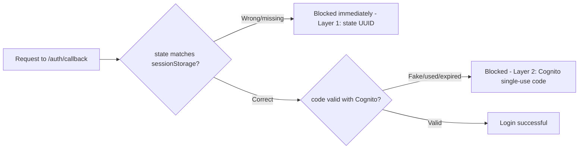

This section tests the system's protection mechanisms: input data validation (XSS prevention), CORS restrictions, JWT authentication, and a review of the overall security checklist against production recommendations.

### 1. Input Data Validation Testing

**Input validation rules table:**

| Field | Valid Example | Invalid Example | Error Message |
|-------|----------------|------------------|---------------|
| **Phone** | 0901234567 → +84901234567<br/>+84901234567 (E.164) | "123456" (too short)<br/>"+1234567890" (non-VN)<br/>"abcdefghij" (non-digit) | "Invalid phone format"<br/>"Only Vietnam (+84) supported"<br/>"Phone must contain digits" |
| **DOB** | 1990-01-15<br/>1900-01-01 (minimum)<br/>2026-12-31 (maximum) | 2027-01-01 (future)<br/>1899-12-31 (too old)<br/>1990-13-45 (invalid date) | "DOB cannot be in the future"<br/>"DOB must be after 1900"<br/>"Invalid date format" |
| **Fullname** | "Nguyen Van A"<br/>"Trần Thị Bích Ngọc" (unicode)<br/>"John Doe" | "A" (< 2 chars)<br/>`<script>alert(1)</script>` (XSS)<br/>"x" × 101 (> 100 chars)<br/>"" (empty) | "Min 2 chars"<br/>"XSS prevention"<br/>"Max 100 chars"<br/>"Fullname required" |

**Unit test coverage:**
- `backend/test_validators_unit.py` → **50+ tests** covering edge cases
  - TestPhoneValidation (15 tests)
  - TestDOBValidation (12 tests)
  - TestFullnameValidation (10 tests)
  - TestEdgeCases (13 tests)

**Run the tests:** `cd backend/ && pytest test_validators_unit.py -v`

---

### 2. CORS & JWT Testing

**Test case summary table:**

| # | Test Case | Input | Expected Result | Status |
|---|-----------|-------|-----------------|--------|
| **CORS VALIDATION** |
| 3.1 | Allowed origin (CloudFront) | Origin: https://dutf3c70nnjzl.cloudfront.net | 200 OK + CORS headers<br/>`Access-Control-Allow-Origin: https://dutf3c...` | PASS |
| 3.2 | Disallowed origin | Origin: https://evil.com | 403 Forbidden (no CORS header) | PASS |
| 3.3 | OPTIONS preflight | OPTIONS request with CORS headers | 200 OK + Access-Control-Allow-Methods: GET, POST, PUT, DELETE, OPTIONS | PASS |
| **JWT AUTHENTICATION** |
| 3.4 | Missing JWT token | No Authorization header | 401 Unauthorized<br/>Error: "Missing Authorization header" | PASS |
| 3.5 | Invalid JWT format | Bearer invalid_token_xyz | 401 Unauthorized<br/>Error: "Invalid JWT token" | PASS |
| 3.6 | Expired JWT token | JWT with exp < current time | 401 Unauthorized<br/>Error: "JWT token has expired" | PASS |
| 3.7 | JWT from different pool | JWT signed by wrong Cognito pool | 401 Unauthorized<br/>Error: "Invalid JWT issuer" | PASS |

**JWT validation flow in Lambda:**
```python
# modules/auth_service.py
def validate_jwt(token: str) -> dict:
    # 1. Decode header to get key ID (kid)
    # 2. Fetch Cognito JWKS from well-known endpoint
    # 3. Verify signature with public key
    # 4. Check exp claim (expiration)
    # 5. Check iss claim (issuer = Cognito pool)
    # 6. Return decoded claims (user_id, email, etc.)
```

**Notes on CORS:**
- Fixed: removed the CORS wildcard `*`
- Only 3 origins are allowed: CloudFront + localhost:5173 + localhost:5174
- Production: the localhost origins should be removed before deploying for real

---

### 3. CSRF State Parameter Testing (Google OAuth)

The Google login flow via the Cognito Hosted UI previously had no `state` parameter, allowing an attacker to trick a victim into clicking a link containing an authorization code prepared by the attacker (Login CSRF). A `state = crypto.randomUUID()` generated on the Frontend has been added, temporarily stored in `sessionStorage`, and verified when Cognito redirects back to `/auth/callback`.

**Test cases performed on production:**

| # | Test Case | How it was done | Expected Result | Status |
|---|-----------|-----------------|-------------------|--------|
| 1 | Normal Google login | Log in through an incognito tab | Successfully reach `/app` | PASS |
| 2 | `state` appears in the URL | DevTools Network → check the `/oauth2/authorize` request | `state=<UUID>` is present | PASS |
| 3 | Wrong `state` (simulated CSRF) | Manually edit the `state` in the callback URL | Redirect to `/login` + error shown, no call made to Cognito | PASS |
| 4 | Correct `state` but fake `code` | Use the real `state` + a fake `code` | Passes layer 1 (state), rejected by Cognito at layer 2 (invalid_grant) | PASS |
| 5 | sessionStorage self-cleanup | Check `oauth_state` after each verification | Key is removed (replay protection) | PASS |

**Two independent protection layers:**



See `BANGIAO-23-07-2026.md` (section 2.3) for full details.

---

### 4. Security Checklist Review

Reference: `SECURITY_CONSIDERATIONS.md`

| Security Item | Status | Notes |
|-----------------|--------|-------|
| **Authentication** | **Implemented** | Cognito JWT token |
| **Authorization** | **Implemented** | Data isolated per user |
| **Input validation** | **Implemented** | Validators for phone, DOB, fullname |
| **XSS prevention** | **Implemented** | Blocks `<script>` tags in fullname |
| **CORS restriction** | **Fixed** | Wildcard removed |
| **CSRF protection (OAuth state)** | **Implemented** | See section 3 above |
| **DynamoDB encryption (KMS)** | **Implemented** | SSE-KMS, key `alias/aws/dynamodb` |
| **HTTPS only** | **Required** | TLS 1.2+ on CloudFront/API Gateway |
| **SQL injection** | **Not applicable** | No SQL database is used (DynamoDB) |
| **Rate limiting** | **Not implemented** | Cognito already has free built-in throttling/lockout; AWS WAF (~$5-10/month) is not proportionate to the current demo/internship scale — recommended when moving to production with higher traffic |
| **Data-at-rest encryption** | **Partially implemented** | DynamoDB has SSE-KMS enabled; S3 keeps the default SSE-S3 (auto-encrypted since 2023) |
| **VPC isolation** | **Not configured** | Lambda runs outside a VPC (public) |
| **OAuth state parameter** | **Implemented** | State added for CSRF protection on the Google OAuth flow |
| **MFA** | **Not enabled** | Can be enabled in Cognito at a later stage |

**Recommendations for production:**
1. Implement per-user rate limiting via AWS WAF once traffic increases
2. Add an API Gateway resource policy (IP whitelist) for administrative endpoints
3. Enable Cognito MFA for sensitive operations
4. Deploy Lambda inside a VPC with a NAT Gateway if deeper network isolation is required

---
